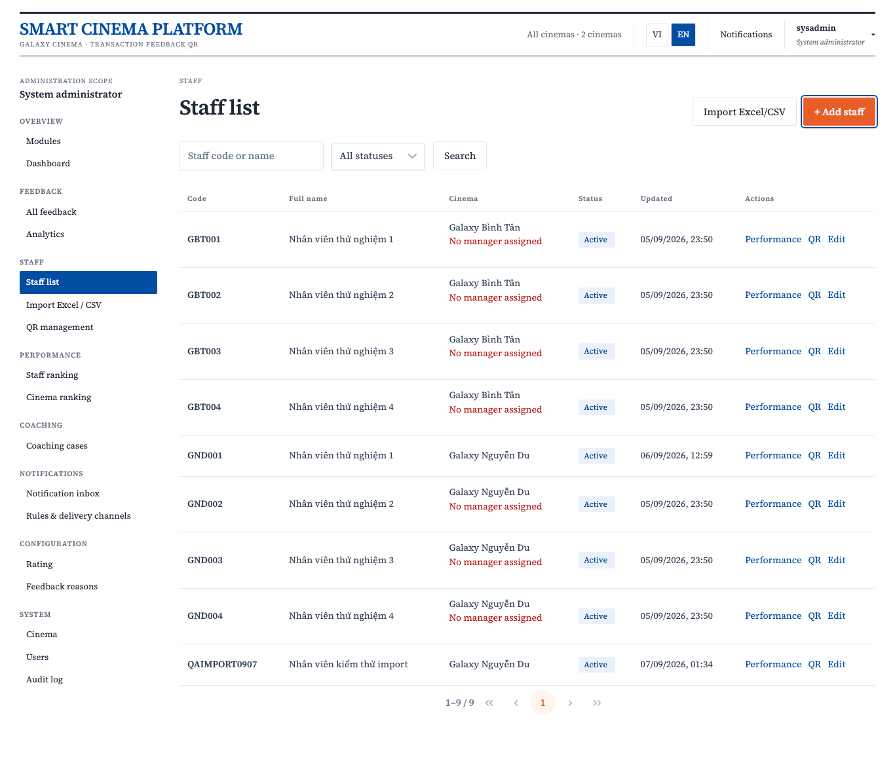
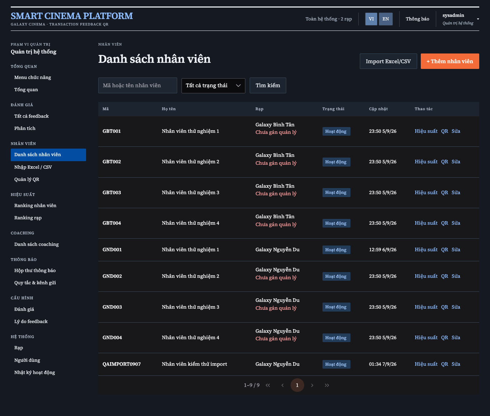
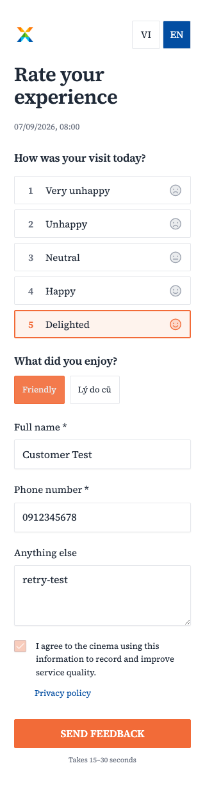

# Shared PrimeNG UI và VI/EN

Nhánh: `feat/shared-ui-i18n-refactor`.

## Cấu trúc

- `frontend/libs/ui/src`: UI standalone trên PrimeNG 21, export qua `@cinema/ui`.
- `frontend/libs/i18n/src`: Transloco, dictionaries VI/EN, cookie, locale ngày/số và nhãn snapshot; export qua `@cinema/i18n`.
- Feature giữ API, phân quyền, cinema scope, dữ liệu và trạng thái form. UI không inject Auth/API.
- Galaxy preset giữ màu cam/xanh, Source Serif 4, responsive và `[data-theme="dark"]`.

## Sử dụng UI

`CinemaButton` là directive dùng PrimeNG ButtonDirective trên `button`/`a`, giữ semantics và routerLink. Mặc định type button; submit khai báo rõ. Hỗ trợ variant primary/secondary/danger/text, icon, disabled và loading.

```html
<button cinemaButton type="submit" [loading]="busy()">
  {{ i18n.t('common.save') }}
</button>
<cinema-field inputId="staff-name" [label]="i18n.t('staff.full_name')">
  <input
    cinemaInput
    id="staff-name"
    name="name"
    [(ngModel)]="draft.name"
    required
  />
</cinema-field>
<cinema-select
  name="status"
  [(ngModel)]="status"
  [aria-label]="i18n.t('administration.status')"
>
  <cinema-option value="ACTIVE" [label]="i18n.t('administration.active')" />
</cinema-select>
```

Native input/textarea dùng Angular value accessor hiện có và host directive PrimeNG. Select, multiselect, checkbox, number, date triển khai CVA (value/touched/disabled) và Validators; dùng được với ngModel và Reactive Forms. Date giữ giá trị API `YYYY-MM-DD`, tránh chuyển UTC làm lệch ngày. Field nhận inputId/label/hint/error/required; liên kết control qua cùng inputId và aria-describedby khi có hint/error.

`CinemaTable` nhận rows/loading/error, total/page/pageSize và phát pageChanged/sortChanged/selectionChanged. Page công khai bắt đầu từ **1**, chuyển từ PrimeNG index 0 tại wrapper. Feature gọi API. Có hai cách render:

- Project `#header`, `#body let-row let-index="index"`, `#empty` cho cột/action riêng.
- `columnDefinitions` với field/label/sortable, `selectable`, tùy chọn `#cell` cho bảng có selection/sort.

`Pager` dùng PrimeNG Paginator cho các màn hình giữ pager riêng. Không slice lại kết quả đã phân trang từ API.

`Overlay` dùng Dialog/Drawer/ConfirmDialog với open/header/variant/saving và closed; hỗ trợ template `#footer` tùy chọn. Saving chặn Escape, mask, nút đóng; feature cũng disable nút hủy/lưu tương ứng. PrimeNG giữ focus trong overlay; wrapper khôi phục focus về trigger khi đóng.

`PageState` dùng Message/Skeleton/Toast; `CinemaBadge` dùng Tag. `RatingControl` / `ReasonChips` và các control nghiệp vụ nhận dữ liệu qua inputs. Route `/ui-showcase` chỉ hoạt động ở development và không gọi API/Keycloak; các route nghiệp vụ giữ nguyên guards.

## i18n và SSR

- `I18n.t(key, params)` hoặc pipe `t`; thêm key ở cả VI/EN cùng tên parameters.
- Catalog chia namespace common/admin/customer/feature. Hiện cả hai catalog được nạp đồng bộ lúc bootstrap để SSR/hydration không chờ HTTP translation. Chưa tách tải network theo lazy scope; route feature vẫn lazy-load.
- VI mặc định; cookie `cinema-language` có Path=/ và SameSite=Lax, riêng từng origin. Server lấy cookie từ Angular REQUEST và mỗi request có I18n riêng. Không có biến locale mutable toàn cục. HTML response private/no-store và Vary: Cookie.
- Chuyển locale cập nhật html lang, PrimeNG locale/ARIA, ngày giờ và số. Ngày giờ nghiệp vụ vẫn Asia/Ho_Chi_Minh. Không tạo lại form/filter/dialog khi chuyển locale.
- `i18n.label(snapshot)` lấy english khi EN, fallback label nếu thiếu. Không dịch tên/người dùng/bình luận. Analytics reason lấy label/english từ snapshot, không lookup cấu hình hiện tại.
- Message lưu lâu hoặc có parameters dùng `translatedMessage(key, params)` để dịch lại khi đổi locale. API error chỉ ánh xạ stable code/status; legacy error vẫn giữ trong response cho client cũ. Không hiển thị technical message.
- File export/QR backend và trang Keycloak nằm ngoài phạm vi dịch UI.

## Inventory đã chuyển

| Nhóm       | Route/surface                                                                 |
| ---------- | ----------------------------------------------------------------------------- |
| Shell/auth | launcher `/`, login, forbidden, menu, scope, theme, notification bell         |
| Quản trị   | staff, staff/import, cinemas, users, audit                                    |
| Feedback   | feedback list/detail, QR/search/confirm, coaching                             |
| Báo cáo    | dashboard, analytics, staff/:id/performance, ranking/:kind                    |
| Cấu hình   | rating, reasons, notifications, notification-rules                            |
| Customer   | /f/:code form, rating/reason, consent/privacy, loading/error, retry/thank-you |

## Kiểm chứng

```sh
pnpm --dir frontend check:ui
pnpm --dir frontend test:unit
pnpm --dir frontend typecheck
pnpm --dir frontend format:check
NG_BUILD_MAX_WORKERS=2 NX_DAEMON=false pnpm --dir frontend build
pnpm --dir frontend test:e2e
# Smoke với Keycloak/API và synthetic account local đã seed:
LIVE_LOCAL_ADMIN=1 pnpm --dir frontend test:e2e
cd backend
go vet ./...
TEST_MONGODB_URI='mongodb://127.0.0.1:27018/?replicaSet=rs0&directConnection=true' go test ./... -count=1
```

Browser tests tự khởi chạy API fixture 4302 và customer SSR production build 4301. Admin showcase dùng dev server 4200. CI không cần Keycloak cho component/customer tests; smoke admin có login được opt-in riêng. Integration Go chỉ dùng database disposable `smart_cinema_test_*` và cleanup.

`check:ui` kiểm tra parity VI/EN và interpolation; parse template để phát hiện text/control thô và key không tồn tại. Native file input, markup ngữ nghĩa, dữ liệu động và icon không phải text dịch là ngoại lệ có chủ đích. Khi thêm namespace mới phải thêm vào danh sách scanner.

Ảnh review nằm trong `output/playwright/`. Quét QR vật lý vẫn cần UAT.

### Kết quả ngày 2026-09-07

- `check:ui`: 680 mục dịch VI/EN, không phát hiện control/text thô thuộc quy tắc scanner.
- Unit locale: 3/3; browser: 9/9 với `LIVE_LOCAL_ADMIN=1`.
- Browser: 15 route admin, sửa staff/cinema, CRUD user, phân trang, import preview lỗi dịch VI/EN, QR batch, coaching/date, notification read, 403/retry/empty. Các thao tác ghi admin dùng API mock để kiểm chứng payload và trạng thái UI; smoke đăng nhập/route dùng Keycloak/API local.
- Component: Reactive Forms value/touched/disabled/required; mặc định button không submit và loading disabled; table selection/sort/page; dialog đổi locale giữ draft, Escape bị chặn khi lưu, khôi phục focus; drawer và confirm.
- Customer: form/submit thất bại/retry/success/reset ở 320/390px; nhãn EN và fallback nhãn cũ; SSR VI/EN đồng thời, cookie, reload/hydration không pageerror.
- Typecheck, format check, production build hai app, Go vet và toàn bộ Go tests (gồm MongoDB integration disposable) đều qua.
- Screenshot đã kiểm tra: admin EN light 1366px, VI/EN dark 1366px; customer EN 320/390px và invalid QR. Physical QR vẫn cần UAT.




